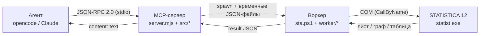
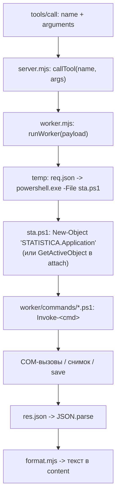
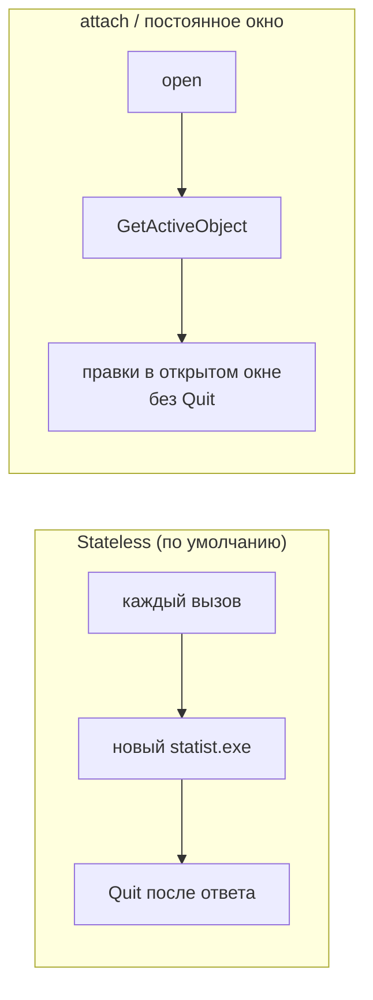
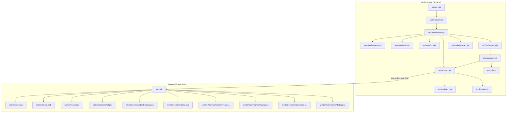

# Архитектура statistica-mcp

Документ описывает устройство MCP-сервера для управления STATISTICA 12 через
COM: из чего он состоит, как проходит вызов инструмента и какие есть режимы
работы.

---

## 1. Общая схема

Ноль внешних зависимостей: протокол реализован на Node.js (стандартная
библиотека), доступ к COM — через встроенный в PowerShell 5.1 `New-Object
-ComObject` и `Microsoft.VisualBasic.Interaction::CallByName`.

---

## 2. Компоненты

### MCP-сервер (`server.mjs` + `src/`)

- `server.mjs` — тонкая точка входа: запускает `startServer` и пишет лог.
- `src/protocol.mjs` — JSON-RPC 2.0 поверх stdio: `initialize`, `ping`,
  `tools/list`, `tools/call`; на stdout только JSON-RPC, логи — в stderr.
- `src/worker.mjs` — запуск воркера: временный каталог, `req.json`/`res.json`,
  `spawn powershell.exe -File sta.ps1`, таймаут, разбор ответа.
- `src/modules.mjs` — таблица модулей STATISTICA (`ANALYSIS_MODULES`),
  enum-константы (`ENUMS`), `resolveModule`.
- `src/format.mjs` — форматирование таблиц и результатов в текст.
- `src/analysis.mjs` — обёртка `analysis()` (запуск анализа + экспорт PDF).
- `src/pdf.mjs` — конвертер PNG → PDF из `node:zlib` (свой одностраничный PDF).
- `src/tools/` — инструменты, сгруппированные по назначению; схема и
  обработчик лежат рядом, `index.mjs` собирает их и добавляет `attach`:
  - `inspect.mjs` — info, list, describe, list_sheets, read, describe_analysis;
  - `edit.mjs` — write, formula, add/rename/delete, sort/select/recode,
    levels/labels;
  - `io.mjs` — export_csv, save_spreadsheet, import_data, screenshot, open,
    dialog;
  - `stats.mjs` — описательные, корреляция, регрессия, ANOVA, кластер, ТС,
    `add_lag_column`, `add_fit_line`, `run_macro`, normality;
  - `engine.mjs` — `run_analysis`.

### Воркер (`sta.ps1` + `worker/`)

- `sta.ps1` — точка входа: DPI-awareness, dot-source модулей, чтение запроса,
  создание/подключение приложения, диспетчеризация `Invoke-<cmd>`, запись
  ответа.
- `worker/com.ps1` — низкоуровневые вызовы COM (`comGet/comSet/comCall`,
  `comSetOne`, `Set-LongName`), подавление диалогов (`Disable-Alerts`),
  закрытие документов (`Close-AllDocuments`/`Close-App`), повтор создания COM
  (`New-ComApp`).
- `worker/sheet.ps1` — доступ к листу: поиск переменной, чтение/запись колонок,
  добавление именованных переменных, имена наблюдений.
- `worker/result.ps1` — маршалинг результатов анализа (таблицы, массивы,
  коллекции, документы).
- `worker/screenshot.ps1` — снимок окна STATISTICA (`CopyFromScreen`, DPI-aware,
  вывод на передний план).
- `worker/commands/` — по одной функции `Invoke-<cmd>` на команду:
  - `structure.ps1` — describe, read, write, addwrite, sort, select, recode,
    levels, labels, sheets;
  - `io.ps1` — export_csv, save_as, import;
  - `analysis.ps1` — describe_analysis, analysis;
  - `macro.ps1` — run_macro (SVB);
  - `open.ps1` — open (постоянное окно);
  - `dialog.ps1` — dialog (снимок панелей анализа, с `call`);
  - `image.ps1` — combine_images (склейка изображений, без STATISTICA).

---

## 3. Жизненный цикл вызова инструмента

---

## 4. Режимы работы

| | Stateless | Attach |
|---|---|---|
| Процесс | новый `statist.exe` на каждый вызов | подключается к открытому окну |
| Закрытие | `Quit` после ответа | программа не закрывается |
| Сохранение | только с явным `save` | правки видны в окне «вживую» |
| Окно | скрытое | видимое (`open`) |
| Когда использовать | пакетные расчёты | ручной ввод, живые правки, снимки панелей |

---

## 5. Обмен данными

Запрос и ответ передаются через временные JSON-файлы (`req.json`
`res.json`) в кодировке **UTF-8**. Это снимает проблемы с кодировками
кириллицы в PowerShell 5.1 при обмене через stdout/stderr. Логи воркера идут
в stderr и пробрасываются в stderr сервера.

---

## 6. Особенности COM (учтено)

- ПрогID `STATISTICA.Application` работает; `_Application`/CLSID из interop —
  нет.
- Параметризованные свойства (`Data(case,var)`, `VData(n)`, `CaseName(i)`)
  читаются/пишутся через `CallByName` с `CallByName` Get/Let; массив значений
  собирается вручную в `[object[]]`.
- Массивы маршалятся только типизированные (`double[]`), длина = число
  наблюдений.
- Пропуски: `-999999998` и объявленный код переменной (`VariableMissingData`).
- Формулы хранятся в длинном имени переменной (`VariableLongName(idx)=...` +
  `Recalculate(idx)`).
- Анализ: `Application.Analysis(id, sheet)` → `.Dialog` (свойства/методы) и
  `.Run()`; результаты — таблицы/массивы/документы.
- Экспорт графиков: `Graph.SaveAs(path)`, расширение задаёт формат
  (`.png/.jpg/.emf` — изображение, `.stg` — родной граф STATISTICA). Из
  результата-массива (таблица + граф) сохраняются только граф-документы: у
  таблицы есть `NumberOfCases`, у графа — нет.
- Диалог модуля создаётся скрытым окном класса `#32770`; его можно показать и
  снять (`dialog`).
- В headless-режиме: `DisplayAlert=$false`, экспорт через
  `ExportTextEx`/`ExportXLS`, закрытие документов `Close($false)`.

---

## 7. Диаграмма исходников

