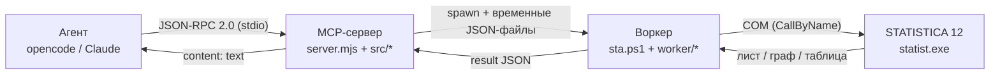

# STATISTICA MCP

MCP-сервер для полноценного управления STATISTICA 12 через её COM-интерфейс. Позволяет агенту (opencode, Claude Desktop и т.п.) работать с файлами `.sta`/`.stw`, редактировать данные, **запускать собственные процедуры STATISTICA** (базовая статистика, корреляция, t-тесты, регрессия, временные ряды и любые другие модули) и забирать результаты таблицами.

**Ноль внешних зависимостей.** Node.js реализует протокол MCP сам, PowerShell-worker обращается к COM. `npm install` не нужен.

---

## Требования

| Компонент | Версия | Проверено |
|---|---|---|
| Windows | 10/11 | да |
| Node.js | >= 18 | 24.19.0 |
| STATISTICA 12 | любая | 12.5.192.7 (x64) |
| PowerShell | 5.1 (системный) | да |

Интернет не требуется.

Проверить, что COM доступен:

```powershell
$app = New-Object -ComObject "STATISTICA.Application"
$app.Visible = $false
$app.Version
$app.Quit()
```

---

## Установка

1. Распаковать проект в любую папку (например `C:\tools\statistica-mcp`).
2. Добавить сервер в `~/.config/opencode/opencode.jsonc`:

```jsonc
{
  "$schema": "https://opencode.ai/config.json",
  "mcp": {
    "statistica": {
      "type": "local",
      "command": ["node", "C:\\tools\\statistica-mcp\\statistica\\server.mjs"],
      "enabled": true
    }
  }
}
```

Для Claude Desktop — `%APPDATA%\Claude\claude_desktop_config.json`:

```json
{
  "mcpServers": {
    "statistica": {
      "command": "node",
      "args": ["C:\\tools\\statistica-mcp\\statistica\\server.mjs"]
    }
  }
}
```

3. Перезапустить клиент.

> Путь в конфиге — именно на `server.mjs`. Он определяет расположение `sta.ps1` относительно себя, поэтому папку можно переносить целиком, но нельзя отделять `sta.ps1` от `server.mjs`.

---

## Проверка установки

В папке проекта:

```bash
node selftest.mjs "C:\путь\к\LAB3.sta"
```

Скрипт создаёт временную копию файла, прогоняет **55 проверок** (все инструменты, включая анализы, формулы, правку данных, уровни измерения, метки значений, запаздывание и сглаживание ВР, экспоненциальное сглаживание, SVB-макрос, нормальность, ANOVA, кластерный и факторный анализ, 2D/3D-графики, fit-линию, экспорт PNG/PDF/CSV/XLSX, скриншот окна и импорт) и печатает результат. Исходный файл не изменяется.

---

## Проверка кода

Встроенный линтер без зависимостей (аналог `ruff check`): синтаксис JS (`node --check`), синтаксис PowerShell (AST-парсер), разрешение `import` и dot-source, разбор JSON, наличие обработчиков у инструментов, а также стиль (CRLF, хвостовые пробелы, финальный перевод строки, табы, длинные строки).

```bash
node scripts/check.mjs            # проверка
node scripts/check.mjs --fix      # исправить CRLF / хвостовые пробелы / финальный перевод
node scripts/check.mjs --strict   # предупреждения тоже считать ошибкой
node scripts/check.mjs --external # дополнительно prettier / eslint / PSScriptAnalyzer, если установлены
```

Или через npm: `npm run check`, `npm run check:fix`, `npm run check:strict`. Код возврата — `1` при ошибках. Правила форматирования продублированы в `.editorconfig`.

---

## Архитектура

Подробное описание устройства — в отдельном файле
[`ARCHITECTURE.md`](ARCHITECTURE.md): схема компонентов, жизненный цикл вызова
инструмента, режимы работы и особенности COM.



- **`server.mjs`** — тонкая точка входа; разбор протокола и логика — в `src/`,
  инструменты — по группам в `src/tools/`. На stdout только JSON-RPC, логи в
  stderr.
- **`sta.ps1`** — точка входа воркера; код — в `worker/` и
  `worker/commands/` (по функции `Invoke-<cmd>` на команду).
- Один вызов = один файл `.sta`; по умолчанию stateless, режим `attach`
  работает с открытым окном.

---

## Инструменты

### Общие

| Инструмент | Назначение |
|---|---|
| `statistica_info` | Доступность COM, версия, путь к `statist.exe`, PID. Вызывайте первым при сбоях. |
| `list_analysis_modules` | Список всех модулей анализа (id + имя) для `run_analysis`. |
| `describe_spreadsheet` | Открыть `.sta`/`.stw`: размер, список переменных (индекс, короткое/чистое/длинное имя, тип, уровень измерения, код пропуска). |
| `list_sheets` | Список листов файла (индекс, имя, размер) без загрузки данных. |
| `read_variables` | Чтение данных. Числовые колонки — векторно, текстовые — строками; пропуски → `null`. |
| `write_variables` | Полная перезапись переменных; числовая колонка требует ровно по значению на наблюдение. |
| `add_variables` | Добавление пустых переменных (`0` numeric, `1` text, `2` integer, `3` byte). |
| `rename_variables` | Переименование коротких/длинных имён (по имени или индексу). |
| `delete_variables` | Удаление диапазона переменных. |
| `set_size` | Изменение размера таблицы. |
| `case_names` | Чтение и запись имён наблюдений (текстовых меток строк). |
| `sort_data` | Сортировка по одному или нескольким ключам (имена наблюдений переезжают вместе со строками). |
| `select_cases` | Оставить только строки, удовлетворяющие условию (`gt/ge/lt/le/eq/ne/in/notin/missing/notmissing`). |
| `recode` | Перекодирование значений переменной по таблице `map` (+ `default`, `missing`). |
| `set_measurement` | Уровень измерения переменной (`auto`/`continuous`/`categorical`/`ordinal`) — чтобы STATISTICA трактовала её как фактор или ковариату. |
| `value_labels` | Текстовые метки значений переменной (`SetTextLabel`); `clear` сбрасывает метки. |
| `set_formula` | Запись формулы в переменную (`=v9*v10`) и пересчёт (`Recalculate`). |
| `import_data` | Импорт текста/Excel в STATISTICA. |
| `export_csv` | Экспорт листа штатным CSV-писателем. |
| `save_spreadsheet` | Сохранение листа в новый файл (`.sta`, `.stw`, `.csv`, `.xlsx`). |
| `combine_images` | Склейка нескольких PNG в один файл (вертикально/горизонтально) — двухпанельные рисунки для отчётов. |
| `statistica_graph` | Построение графика (`module` + `variables`) и экспорт в изображение или `.stg` (`out`): `.png`/`.jpg`/`.emf`/`.stg`. Через `properties.GraphType`: `1` у 11012 — один график с несколькими линиями, `6` у 11021 — 3D Surface. |
| `statistica_screenshot` | Показать окно STATISTICA и снять экран для отчёта (`mode`: `screen` — весь экран по умолчанию, `window` — окно приложения, `document` — активная таблица/график). |
| `statistica_open` | Запустить или переиспользовать видимое окно STATISTICA (с опциональным файлом) и оставить его открытым — для работы через `attach` без перезапуска приложения. |
| `statistica_dialog` | Открыть диалог модуля анализа и снять саму панель пакета (Time Series/Forecasting, Transformations и др.); `run:true` — панель второго уровня, `mode:screen` — полный экран. Приложение не закрывается. |

### Режим «вживую» (`attach`)

Любой инструмент данных/анализа принимает `attach: true`. В этом режиме worker не создаёт новый процесс, а подключается к **уже открытому** окну STATISTICA (`Marshal.GetActiveObject`), правит его активный лист и **не закрывает** программу. Так значения и формулы видны и обновляются прямо в открытом документе. Если `path` не указан — берётся активный лист (в `attach`-режиме путь необязателен).

Чтобы не запускать окно вручную, используйте `statistica_open` — он запускает (или переиспользует уже открытый) видимый экземпляр, открывает файл и оставляет его открытым. `GetActiveObject` при нескольких копиях возвращает один экземпляр (первый), поэтому `statistica_open` переиспользует запущенный, чтобы `attach` попадал в то же окно.

```
set_formula { "path": "...\\LAB3.sta", "variable": "TS_Prod", "formula": "v9*v10", "attach": true }
write_variables { "path": "...\\LAB3.sta", "columns": [{"index": 5, "values": [ ... ]}], "attach": true }
```

### Статистика

| Инструмент | Модуль / механизм |
|---|---|
| `descriptives` | Быстрый расчёт в Node по данным из COM (N, missing, mean, sd, se, min, q1, median, q3, max, sum). |
| `statistica_descriptives` | Описательные статистики **движком** Basic Statistics (включая квантили, асимметрию, эксцесс). |
| `statistica_normality` | Проверка нормальности (Basic Statistics): описательные статистики + Шапиро–Уилк и Колмогоров–Смирнов/Лилиефорс + гистограмма. |
| `statistica_correlation` | Матрица корреляций Пирсона. |
| `statistica_frequencies` | Частотные таблицы и гистограммы. |
| `statistica_t_test` | t-тесты: `single` (к константе) и `dependent` (парные). |
| `statistica_regression` | Множественная регрессия (модуль GRM). |
| `statistica_anova` | Дисперсионный анализ / GLM (модуль 4100): таблица ANOVA (`UnivariateResults`) и оценки параметров. |
| `statistica_cluster` | Иерархический кластерный анализ (модуль 2201): расписание объединений, матрица расстояний, описательные статистики. |
| `statistica_factor` | Факторный анализ / метод главных компонент (модуль 2101): собственные значения, нагрузки, общности. |
| `statistica_correlation_matrix` | Строит лаговые произведения ряда (`Lag1..LagK` = `x(t)*x(t-L)`, опц. SMA) или сдвинутые ряды (`mode:"shift"`). |
| `add_lag_column` | Считает оценку на одном лаге (`x(t)*x(t-lag)` или сдвиг) и дописывает **одну** колонку `Lag_m` в целевой лист — для пошагового построения матрицы. |
| `statistica_time_series` | Временные ряды: `descriptives`, `autocorrelation`, `partial_autocorrelation`, `cross_correlation`, `arima`, `spectral`, `smoothing` (центрир. MA), `shift`, `exponential_smoothing` (модели `simple`, `holt`, `holt_additive` (Тейл–Вейдж), `holt_multiplicative` (Уинтерс), `damped`, `exponential_trend`), `differencing`, `seasonal_decomposition`. Параметр `out` экспортирует график результата (например, АКФ/ЧАКФ) в изображение или `.stg`. |
| `add_fit_line` | МНК-аппроксимация `y` по `x` (по умолчанию по номеру наблюдения), степень `degree` (1..6) — пишет fitted-значения новой переменной (замена интерактивного fit на графике). |
| `run_macro` | Выполнить код STATISTICA BASIC (SVB) или `.svb`-файл, где `ActiveSpreadsheet` — открытый лист (для рекуррентных моделей DWLS/Lowess/EWPR из ЛР6–8). |
| `statistica_graph` | График и его экспорт в изображение (`.png`/`.jpg`/`.emf`) или `.stg`; `.pdf` собирается встроенным конвертером PNG→PDF. |

### Универсальный движок

| Инструмент | Назначение |
|---|---|
| `describe_analysis` | Интроспекция диалога анализа: свойства, методы и известные enum-константы. Помогает собрать запрос к `run_analysis`. |
| `run_analysis` | Запуск **любой** процедуры последовательностью шагов. |

#### Шаги `run_analysis`

```jsonc
{
  "path": "C:\\data\\LAB3.sta",
  "module": 1901,
  "steps": [
    { "set":  { "Variables": "2", "FocusTimeSeriesVariable": 1 } },
    { "call": "ARIMAAndAutocorrelationFunctions" },
    { "set":  { "NumberOfAutoregressiveParameters": 1, "NumberOfMovingAverageParameters": 0 } },
    { "run":  true },
    { "set":  { "NumberOfCasesToForecast": 12 } },
    { "result": "Summary" },
    { "result": "ForecastCases" },
    { "saveGraph": "C:\\out\\forecast.png", "result": "PlotSeriesAndForecasts" }
  ]
}
```

- `set` — присвоить свойства диалога (массивы и строки допустимы; `Variables` принимает `"1 3 5"`, `"2-4"` или массив индексов).
- `call` — вызвать метод диалога (например, `SpectralFourierAnalysis`, `Transformations`, `ExponentialSmoothingAndForecasting`). Опционально `args`.
- `run` — выполнить анализ (`Application.Analysis(...).Run`).
- `result` — прочитать свойство после запуска. Результат маршалится как таблица, массив, коллекция или идентификатор документа. Если свойство параметризованное (например `Summary(1)`), индекс подставляется автоматически.
- `saveGraph` — прочитать свойство-график (по умолчанию `Graphs`) и сохранить его; путь определяется расширением (`.png`/`.jpg`/`.emf` — изображение, `.stg` — родной формат STATISTICA). Сохраняются **только графики**: таблицы из того же результата (например, `Autocorrelations` = таблица + график) пропускаются, поэтому файл пишется ровно по указанному пути без суффиксов. Родительские папки создаются.

Неверные свойства/методы не прерывают анализ: они попадают в блок `Warnings` ответа.

---

## Примеры

**Описательные и корреляция**

```
statistica_descriptives { "path": "...\\LAB3.sta", "variables": [2, 3, 4] }
statistica_correlation   { "path": "...\\LAB3.sta", "variables": [2, 3, 5] }
```

**Параметрическая регрессия**

```
statistica_regression { "path": "...\\LAB3.sta", "dependent": 2, "predictors": [1] }
```

**ARIMA с прогнозом**

```
statistica_time_series {
  "path": "...\\LAB3.sta", "procedure": "arima", "variables": [2],
  "arOrder": 1, "maOrder": 0, "difference": true, "forecasts": 12
}
```

**Сглаживание и спектр**

```
statistica_time_series { "path": "...", "procedure": "smoothing", "variables": [2], "window": 3 }
statistica_time_series { "path": "...", "procedure": "spectral",  "variables": [2] }
```

**Формула и корреляционное произведение**

```
set_formula { "path": "...\\LAB3.sta", "variable": 19, "formula": "v9*v10" }
statistica_correlation_matrix { "path": "...\\LAB3.sta", "variable": "TS_Nrm", "lags": 12, "smooth": 3 }
```

**ANOVA и факторный анализ**

```
statistica_anova  { "path": "...\\LAB3.sta", "dependent": 2, "between": [1, 3] }
statistica_factor { "path": "...\\LAB3.sta", "variables": [2, 3, 4], "method": "principal_components", "factors": 2 }
```

**Правка данных**

```
case_names  { "path": "...\\LAB2.sta", "names": ["янв", "фев", "мар"] }
sort_data   { "path": "...\\LAB2.sta", "variables": [1, 2], "order": [0, 1] }
select_cases{ "path": "...\\LAB2.sta", "variable": 2, "op": "notmissing", "save": "...\\clean.sta" }
recode      { "path": "...\\LAB2.sta", "variable": 1, "map": { "1": 10, "2": 20 }, "default": 0 }
```

**График в файл (2D-диаграмма рассеяния)**

```
statistica_graph {
  "path": "...\\LAB3.sta", "module": 11003, "variables": "2 | 11",
  "properties": { "GraphType": 0 }, "out": "C:\\...\\reports\\scatter.png"
}
```

**Любая процедура — движок**

```
list_analysis_modules {}
describe_analysis { "path": "...\\LAB3.sta", "module": 4100 }   // GLM
run_analysis {
  "path": "...\\LAB3.sta", "module": 1301,
  "steps": [
    { "set": { "Statistics": 0 } },
    { "run": true },
    { "set": { "Variables": "2-4", "Mean": true, "ValidN": true } },
    { "result": "Summary" }
  ]
}
```

---

## Особенности COM, учтённые сервером

- **ProgID `STATISTICA.Application` работает, а `_Application` — нет.** Сборка interop не используется, всё через `New-Object -ComObject` + `Microsoft.VisualBasic.Interaction::CallByName`.
- **Параметризованные свойства** (`Data(case,var)`, `VData(var)`, `VariableName(n)`) требуют `CallByName` с `CallType::Get` / `::Let`.
- **Массивы маршалятся только типизированные.** `put_VData(n, [double[]])` записывает колонку векторно; длина массива должна быть ровно `NumberOfCases`.
- **Пропуски.** `VData` возвращает `-999999998` для «никогда не записанных» ячеек, а у переменной может быть собственный код (`VariableMissingData`, в реальных файлах встречается `-9999`). Сервер считает пропуском оба.
- **`GetData` при `nbVars > 1` добавляет метку строки**, поэтому колонки читаются по одной.
- **`CallByName` не сочетается с массивом значений в одном аргументе** — из-за этого используется `comSetOne` и ручная сборка `[object[]]`.
- **Time Series `TypeOfTransformation`.** Сеттер не принимает флаговые константы (`0x40000000 + n`) и падает с `Access Violation`; нужно передавать индекс без флага: `Smoothing = 1`, `Fourier = 5`, `Autocorrelation = 7`, `Descriptive = 8`, `Differencing = 4`. Таблица — в `describe_analysis`.
- **ARIMA `NumberOfCasesToForecast`** задаётся после `Run`.
- **Формулы.** Формула хранится в длинном имени переменной. `VariableLongName` — индексируемое свойство с аксессором `Set`, `CallByName` его не берёт; присваивать нативно (`$ss.VariableLongName(idx) = "=..."`), затем `Recalculate(idx)`.
- **Графики.** Чтение `.Graphs` само строит график (явный `Run` у графового модуля даёт `E_UNEXPECTED`); экспорт — `Graph.SaveAs(path)`, расширение задаёт формат.
- **Live-режим.** `Marshal.GetActiveObject('STATISTICA.Application')` есть в PowerShell 5.1 (нет в PowerShell 7); в режиме `attach` программа не закрывается.
- **Модальные окна.** В headless-режиме воркер ставит `Application.DisplayAlert = $false`, экспортирует таблицы через `ExportTextEx`/`ExportXLS` (без окон «features will be lost»/«Save As Text File») и перед выходом закрывает все документы `Close($false)`, поэтому окно «Save changes to Workbook1?» не блокирует `Quit`.
- **PDF.** `Graph.SaveAsPDF`/`SaveAsFormat(PDF)` возвращают `False`; PDF собирается встроенным конвертером PNG→PDF (граф экспортируется в PNG, затем оборачивается в PDF).
- **Скриншоты.** `statistica_screenshot` показывает окно (`Visible=$true`) и снимает пиксели через `Graphics.CopyFromScreen`: `PrintWindow` не отрисовывает дочерние MDI-окна (таблицу/график), поэтому по умолчанию (`mode=screen`) снимается весь виртуальный экран (все мониторы) — обрезать можно вручную (`window` — окно приложения, `document` — только активная таблица/график). Свёрнутое окно восстанавливается (`ShowWindow`) и принудительно выводится на передний план (`AppActivate`/`SwitchToThisWindow`/`SetForegroundWindow`); если не удалось — ответ содержит предупреждение. Воркер объявляет себя DPI-aware (`SetProcessDPIAware`): без этого Windows виртуализирует экран (2560×1359 вместо 5120×2718) и кадр обрезается.
- **Методы с `out`-параметрами** (`Statistics`, `ColumnStats`) через `CallByName` не работают, поэтому часть описательных статистик считает Node.

---

## Ограничения

1. **По умолчанию stateless:** каждый вызов — новый процесс `statist.exe`, задержка в несколько секунд; изменения сохраняются только с `save`. Режим `attach` работает с открытым окном без закрытия.
2. **Пресеты** покрывают популярные сценарии; полный доступ — через `run_analysis` + `describe_analysis`.
3. **Методы с `out`-параметрами** (`Statistics`, `ColumnStats`) недоступны через `CallByName` — часть статистик считается в Node.
4. **Графики** сохраняются в изображения или `.stg`; интерактивного редактирования графов нет.

---

## Доработка

- **Новый инструмент:** добавьте `{ tools, handlers }` в подходящую группу `src/tools/*.mjs`. Она подключится сама через `src/tools/index.mjs`.
- **Новая команда воркера:** добавьте функцию `Invoke-<cmd>($app, $ss, $req)` в `worker/commands/*.ps1` — диспетчер найдёт её по имени.
- **Новый анализ:** обычно достаточно `run_analysis`; пресет нужен только для частого сценария.
- **Известные enum-константы** перечислены в `ENUMS` (`src/modules.mjs`); их можно дополнить из отчёта.

---

## Файлы

```
statistica/
  server.mjs                     точка входа MCP-сервера
  src/
    constants.mjs                имя, версия, протокол, таймаут
    log.mjs                      логи в stderr
    util.mjs                     requirePath
    protocol.mjs                 JSON-RPC 2.0, stdio, initialize/ping
    worker.mjs                   запуск sta.ps1 через PowerShell, temp-файлы
    modules.mjs                  таблицы модулей и enum-констант
    format.mjs                   форматирование таблиц/результатов
    analysis.mjs                 обёртка analysis() (+ экспорт PDF)
    pdf.mjs                      конвертер PNG -> PDF (без зависимостей)
    tools/
      index.mjs                  сборка инструментов и обработчиков
      inspect.mjs                info, list, describe, list_sheets, read, describe_analysis
      edit.mjs                   write, formula, add/rename/delete, sort/select/recode, levels/labels
      io.mjs                     export_csv, save_spreadsheet, import_data, screenshot, open, dialog
      stats.mjs                  описательные, корреляция, регрессия, ANOVA, кластер, ТС, add_lag_column, add_fit_line, run_macro, normality
      engine.mjs                 run_analysis
  sta.ps1                        точка входа COM-воркера
  worker/
    com.ps1                      низкоуровневые вызовы COM, подавление диалогов
    sheet.ps1                    доступ к листу (чтение/запись переменных)
    result.ps1                   маршалинг результатов анализа
    screenshot.ps1               снимок окна STATISTICA (CopyFromScreen)
    commands/
      structure.ps1              describe, read, write, sort, select, recode, levels, labels, sheets
      io.ps1                     export_csv, save_as, import (ExportTextEx/ExportXLS)
      analysis.ps1               describe_analysis, analysis
      macro.ps1                  run_macro (SVB, ActiveSpreadsheet)
      open.ps1                   statistica_open (постоянное окно)
      dialog.ps1                 statistica_dialog (снимок панелей анализа)
  ARCHITECTURE.md                схема устройства (Mermaid)
  selftest.mjs                   самопроверка (53 проверки)
  scripts/
    check.mjs                    линтер: парсинг, импорты, стиль (--fix, --strict, --external)
  .editorconfig                  правила форматирования
  package.json                   зависимостей нет
  reports/
    development-report.md        отчёт: проблемы, гипотезы, решения, итог
    improvement-plan.md          план дальнейшего развития
```
