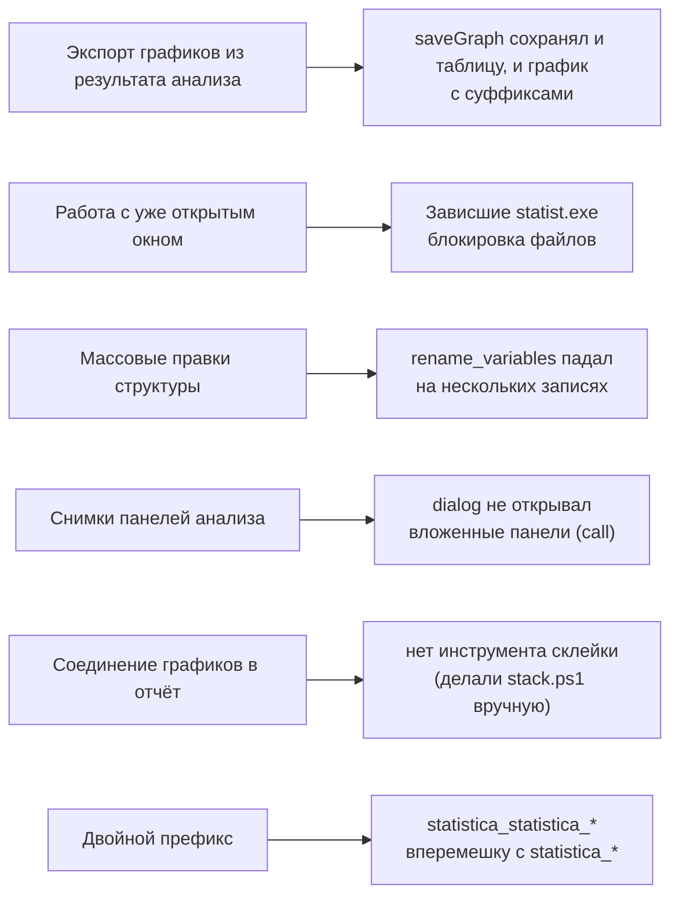

# План доработки STATISTICA MCP v2.4

Составлен по итогам выполнения ЛР3 и ЛР4 (моделирование НВР, экспорт графиков, сборка отчётов).
Формат: проблема → как должно быть → критерий приёмки → статус.

- Версия: 2.3 → 2.4
- Среда: Windows, Node.js ≥ 18, PowerShell 5.1, STATISTICA 12.5 x64

---

## 1. Что показала работа

При построении ЛР3/ЛР4 регулярно возникали одни и те же трения:

## 2. Задачи (P0 — баг-фиксы)

| # | Улучшение | Как должно быть | Критерий приёмки | Статус |
|---|---|---|---|---|
| 1 | `rename_variables` на нескольких записях | Переименование пачки переменных без ошибки | Переименование ≥5 переменных проходит | ✅ |
| 2 | `add_variables` без `after` | Без `after` — добавить в **конец** таблицы | Новая переменная в конце, `SERIES_G` не сдвигается | ✅ |
| 3 | Надёжное сохранение | Сохранение в путь, совпадающий с открытым файлом | `save` в исходный путь не падает с «файл занят» | ✅ |
| 4 | `dialog` с `call` | Открыть вложенную панель (напр. ES) и снять | Снимок панели `ExponentialSmoothingAndForecasting` | ✅ |

## 3. Задачи (P1 — функциональность)

| # | Улучшение | Как должно быть | Статус |
|---|---|---|---|
| 5 | Единый префикс имён инструментов | Убрать `statistica_` из имён → клиент даёт `statistica_<tool>` | ⏳ |
| 6 | `combine_images` | Склейка двух PNG (вертикально/горизонтально) — двухпанельные графики | ✅ |
| 7 | Экспоненциальное сглаживание | Управление начальным значением; EMA(α;L) | ⏳ |
| 8 | Выбор экземпляра по PID | `attach` в нужное окно при нескольких копиях | ⏳ |
| 9 | Workbook `.stw` | Сборка нескольких графиков в один файл | ⏳ |

## 4. Задачи (P2 — документация)

| # | Улучшение | Статус |
|---|---|---|
| 10 | Зафиксировать: вторая ось графиков через COM недоступна | ⏳ |
| 11 | Зафиксировать ограничения PowerShell 5.1 (кодировки, длинные строки) | ⏳ |

---

## 5. Критерии готовности

- `node scripts/check.mjs` — 0 ошибок.
- `node selftest.mjs <файл>` — все проверки PASS.
- Новые возможности описаны в README/ARCHITECTURE/BUGS.
- Каждое улучшение — отдельный коммит на русском.
